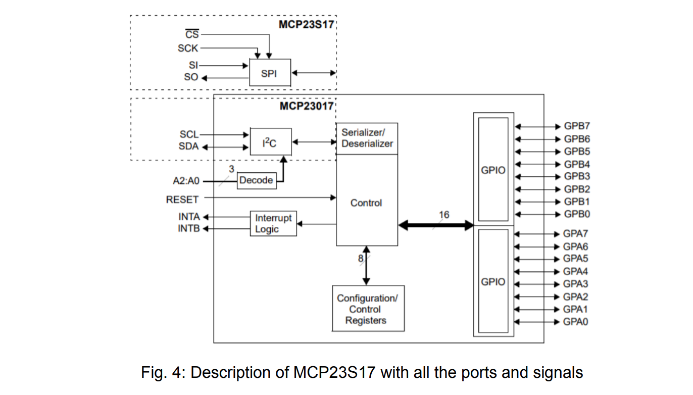

# Software

<p style="text-align:justify">
The next step in the project was to implement software to control the position of two
stepper motors and stabilize the position of camera. Stepper motors are driven by a
specially designed PCB that is connected to the BeagleBone and is controlled by a
I2C-Interface. A yaw rotation is a movement around the yaw axis to the left or right
direction. A pitch rotation is a movement in accordance with vertical axis and moves
up and down. As a reference position of the stepper motor is zero point. It is the
middle value between limited maximum (+100) and minimum (-100) range. In the
software, it enables to increase or decrease every step by one. External library
“ncurses” gives possibility to use arrow keys from the keyboard in application of both
camera axis controlling.
Main program includes some header files which are used to define various functions
in added function libraries.              
</p>

### <b> #include <stdio.h> </b>
This is a standard library in C language. Provides standard functions to manipulate
the inputs and outputs of the file (35 basic functions).

### <b> #include <signal.h> </b>
The signal.h header defines several macros to handle different signals reported
during a program's execution. An example of use is SIGINT macro which interrupts
signal while any problem with I2C happens.

### <b>#include <stdlib.h> </b>
A standard library including functions responsible for memory allocation, process
control and conversions between different types. (As an example ATOI converts
string to integer)

### <b>#include <unistd.h></b>
This header defines different symbolic constants and types commonly used in C
language.

### <b>#include <rc/i2c.h></b>
Robot Control library supporting I2C protocol. It allows to initialize connection,
read/write/send bytes and words to/from a device register.

### <b>#include <curses.h></b>
Includes all necessary symbolic constants assigned to the representing function key
values. It allows to get/send value of any key from the keyboard. Additionally it is
possible to create a new window. (2-dimensional array of characters representing all
or part of a CRT screen) 

### <b>#include <math.h></b>
Basic mathematical operations are implemented in this library. As a standard library
it provides specific functions and mathematical constants as well.

Preprocessor directives define constant variables with values that can be found and
interpreted later in the code. An example from the source file is following:

```C++
#define I2CBUS 1
#define MCP 0x27
#define PORTA 0x12
#define PORTB 0x13
```

A function prototype is simply the declaration of a function that specifies function's
name, parameters or return type. It doesn't contain function body. Pointer declaration
is defined in functions zero_yaw and zero_pitch. It stores actual value of stepper
motor.

```C++
void zero_yaw(int *number_steps);
void zero_pitch(int *number_steps);
```

A function prototype gives information to the compiler that the function may later be
used in the program. Special functions were created to control every step and
direction of stepper motors and are explained below.

<b>Kbhit</b> – this function is set to give as a result 1 whenever keyboard is pressed,
otherwise the default value is 0.

<b>zero_yaw</b> – function responsible for movement in yaw axis, it reads position of the
first step motor.

<b>while LOOP</b> – while loop checks whether maximum position is reached and stores
actual step position by returning the address of a variable data. If the final position is
reached, the motor stops and end switch initialize the movement of the second
stepper motor.

<b>for LOOP</b> – this loop switches between first and second stepper motor when angle
range is less than 100°.

<b>zero_pitch</b> – this function is analogical to the zero_yaw but with a different axis
rotation.

<b>step_yaw</b> – function verifies whether maximum positive or negative value is
achieved. In this case returns -1, otherwise rotates in one direction depending on the
current value in a variable number_steps. Positive value in number_steps moves the
yaw axis anticlockwise, negative one moves it clockwise. At the end updated value in
a variable *all_steps is given back.

<b>step_pitch</b> – this is again analogical function for a second axis.

Main function contains graphical menu shown in the console and is made with help
of ncurses library. It includes all described functions above. Infinity loop catches all
pressed arrow keys and invokes function from a case instruction.


## <b>Main function</b>
```C++

int main()
{
    int res;
    int number_steps;
    int c;
    int row, col;
    int yaw, pitch;
    int delta_pos;

    // set signal handler so the loop can exit cleanly
    signal(SIGINT, __signal_handler);
    running = 1;

    if((res = rc_i2c_init(I2CBUS, MCP)) != 0){
        printf("Can not open I2C-Dev-File\n");
        return -1;
    }

    /* Preparation of the Portexpander MCP23017 */
    /* all pins of Port A are inputs */
    rc_i2c_write_byte(I2CBUS, 0x00, 0xff); 
    /*all pins of Port B are outputs*/
    rc_i2c_write_byte(I2CBUS, 0x01, 0x00); 

    zero_yaw(&number_steps);
    zero_pitch(&number_steps);
    zero_pitch(&number_steps);

    initscr();
    keypad (stdscr, TRUE);
    noecho();
    cbreak();
    nodelay(stdscr, TRUE);
    scrollok(stdscr, TRUE);

    c = 0;
    getmaxyx(stdscr, row, col);

    mvprintw (2, (col/2)-20, "CONTROL-PANEL FOR A CAMERA POSITION-CONTROLLER");
    mvprintw (4, (col/2)-6, "CHANGE POSITION WITH");
    mvprintw (8, col/2, " ");
    addch(ACS_UARROW);
    mvprintw (9, (col/2)-2, " ");
    addch(ACS_LARROW);
    mvprintw (9, (col/2)+2, " ");
    addch(ACS_RARROW);
    mvprintw (10, col/2, " ");
    addch(ACS_DARROW);
    mvprintw (12, (col/2)-5, "Stop with 'q'");
    
    refresh();
    yaw = 0;
    pitch = 0;
    delta_pos = 1;
    
    while (c != 'q' && running == 1) {
        if (!kbhit()){
            mvprintw (row-4, (col/2)-9, "Setpoint Yaw --> %*d\n\n", 3, yaw );
            mvprintw (row-3, (col/2)-9, "Setpoint Pitch --> %*d\n\n", 3, pitch);
            refresh();
        }
        else {
            c = getch();
            switch(c) {
                case KEY_RIGHT:
                    if ((yaw + delta_pos) < POSITION_MAX){
                        step_yaw(delta_pos, &yaw, POSITION_MAX, POSITION_MIN);
                    }
            break;
            case KEY_LEFT:
                if ((yaw - delta_pos) > POSITION_MIN){
                    step_yaw(-delta_pos, &yaw, POSITION_MAX, POSITION_MIN);
                }
            break;
            case KEY_UP:
                if ((pitch + delta_pos) < POSITION_MAX){
                    step_pitch(delta_pos, &pitch, POSITION_MAX, POSITION_MIN);
                }
            break;
            case KEY_DOWN:
                if ((pitch - delta_pos) > POSITION_MIN){
                    step_pitch(-delta_pos, &pitch, POSITION_MAX, POSITION_MIN);
                }
            break;
            }
        }
    }
    endwin();
    rc_i2c_close(I2CBUS);
    return 0;
}
```
</br>

#  Hardware

### <b> 1. Stepper motors</b>

In this project 8 nema stepper motors were used with step angle equal to 1.8 deg. It
has 4 wires, each phase draws 0.3A at 12.0V, with holding torque 3Nm.

### <b>Electrical Specification</b>

-  Manufacturer Part Number: 8HS15-0304S
-  Motor Type: Bipolar Stepper
-  Step Angle: 1.8 deg
-  Holding Torque: 0.03 Nm
-  Rated Current/phase: 0.3 A
-  Voltage: 12 V
-  Phase Resistance: 40 Ω
-  Inductance : 18mH ± 20% (1KHz)

</br>
<p align="center">
  
</p></br>

<span style="text-align:justify">

A bipolar stepper motor has one winding per stator phase. A two phase bipolar
stepper motor will have 4 leads. In a bipolar stepper we don’t have a common
lead like in a uni-polar stepper motor. Hence, there is no natural reversal of
current direction through the winding.
In order to drive a bipolar stepper, we need a driver IC with an internal H bridge
circuit. This is because, in order to reverse the polarity of stator poles, the current
needs to be reversed. This can only be done through H bridge.

Another reason why H Bridge is used is because the stator coils are nothing but
inductor. When coil current changes direction a spike is generated. A normal
micro-controller pin cannot tolerate such high spikes without damaging itself.
Hence to protect micro-controller pins, H bridge is necessary.
</span>

### <b>DRV8825 Stepper Motor Driver</b>

For the above mentioned reasons, we are using DRV8825 Stepper Motor Driver
to drive our bipolar stepper motor. It operates from 8.2 V to 45 V and can deliver
up to approximately 1.5 A per phase without a heat sink or forced air flow (rated
for up to 2.2 A per coil with sufficient additional cooling).

  ###  <b>Electrical Specifications</b>
- Minimum operating voltage: 8.2 V
- Maximum operating voltage: 45 V
- Continuous current per phase:1.5 A
- Maximum current per phase: 2.2 A
- Minimum logic voltage: 2.5 V
- Maximum logic voltage:5.25 V
- Microstep resolutions: full, 1/2, 1/4, 1/8, 1/16, and 1/32


Interfacing with Stepper motor and Microcontroller:

### <b>Power Connection:</b>
The driver requires a motor supply voltage of 8.2 – 45 V to be connected across
VMOT and GND. This supply should have appropriate decoupling capacitors
close to the board, and it should be capable of delivering the expected stepper
motor current.
### <b>Motor connections:</b>
Four, six, and eight-wire stepper motors can be driven by the DRV8825 if they
are properly connected.
### <b>Step (and microstep) size:</b>
A microstepping driver such as the DRV8825 allows higher resolutions by
allowing intermediate step locations, which are achieved by energizing the coils
with intermediate current levels. The resolution (step size) selector inputs (MODE0, MODE1, and MODE2) enable
selection from the six step resolutions according to the table below. All three
selector inputs have internal 100kΩ pull-down resistors, so leaving these three
microstep selection pins disconnected results in full-step mode.

</br>
<p align="center">
  
</p></br>

### <b>Control inputs:</b>
  
Each pulse to the STEP input corresponds to one microstep of the stepper motor
in the direction selected by the DIR pin. These inputs are both pulled low by
default through internal 100kΩ pull-down resistors. If you just want rotation in a
single direction, you can leave DIR disconnected.

</br>
<p align="center">
  
</p></br>

### <b>MCP23017 I2C Expander</b>

The reason behind using an I2C expander is that we wanted to drive 4 motors with a
single microcontroller but the microcontroller has only two i2C pins. The MCP23017
uses two i2c pins (these can be shared with other i2c devices), and in exchange gives you 16 general purpose pins. You can set each of 16 pins to be input, output,
or input with a pull up. There's even the ability to get an interrupt via an external pin
when any of the inputs change so you don't have to keep polling the chip. You can
set the i2c address by tying the ADDR0-2 pins to power or ground, for up to 8 unique
addresses. 

### Features

- 16-Bit Remote Bidirectional I/O Port
- Three Hardware Address Pins to Allow Up to Eight Devices on the Bus
- INTA and INTB Can Be Configured to Operate Independently or Together
- External Reset Input
- Low Standby Current: 1 µA (max.)
- Operating Voltage:
- 2.7V to 5.5V @ -40°C to +85°C
- 4.5V to 5.5V @ -40°C to +125°C

</br>
<p align="center">
  
</p></br>

### <b>End Switches</b>

An ‘End Switch’ and its electromechanical counterpart also known as limit switch.
It is an electric switch mounted on the motor linkage that stops the motor
movement when it reaches maximum limit of angle range by opening the 
6
electrical circuit to the motor. It is applied in the project as a damper between left
and right position of the stepper motor. Maximum angle on each side to the
referencing position is equal to 100º. The idea of this application is to rotate
gimbal smoothly in two axis with wide angle range. 


### <b>Step-Down Voltage Regulator D36V28F5</b>

The D36V28Fx family of buck (step-down) voltage regulators generates lower
output voltages from input voltages as high as 50 V. They are switching
regulators (also called switched-mode power supplies (SMPS) or DC-to-DC
converters), which makes them much more efficient than linear voltage
regulators, especially when the difference between the input and output voltage is
large. These regulators can typically support continuous output currents between
2 A and 4 A, depending on the input voltage and output voltage.

<b>Connections:</b>

This regulator has six connections: power good (PG), enable (EN), input voltage
(VIN), output voltage (VOUT), and two ground (GND) connections.
The input voltage, VIN, powers the regulator. Voltages up to 50 V can be applied
to VIN. Generally, the effective lower limit of VIN is VOUT plus the regulator’s
dropout voltage, which varies approximately linearly with the load. VOUT is the
regulated output voltage.

</br>
<p align="center">
  
</p></br>

D24V5F3 synchronous buck voltage regulator takes an input voltage of up to 36
V and efficiently reduces it to 3.3 V while allowing for a maximum output current
of 500 mA. This regulator offers typical efficiencies between 80% and 90% and
has a very low dropout, so it can be used with input voltages as low as a few
hundred millivolts above 3.3 V.

### <b>Relay</b>

Two relays have been used for power connection. The relay was designed along with help of Prof. Brummer. At the input end of the power supply, the 12V power
supply is used to charge the accumulator. The rechargeable accumulator is used
then to provide power directly to the board.

</br>
<p align="center">
  
</p></br>

## Power Circuit Board Design

I divided the PCB design into three different parts and then interconnected them using KiCad software.

</br>
<p align="center">
  
</p></br>

</br>
<p align="center">
  
</p></br>

</br>
<p align="center">
  
</p></br>